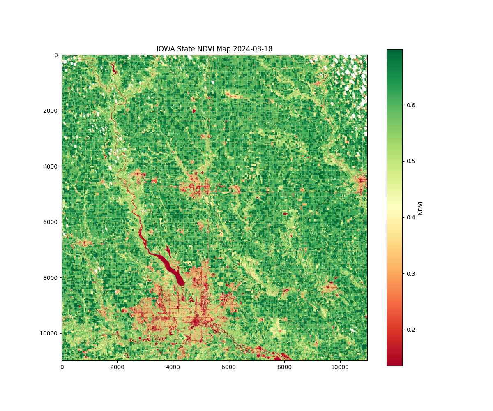
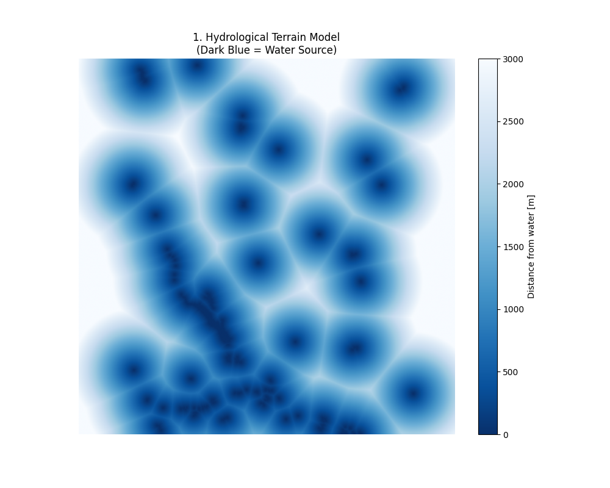
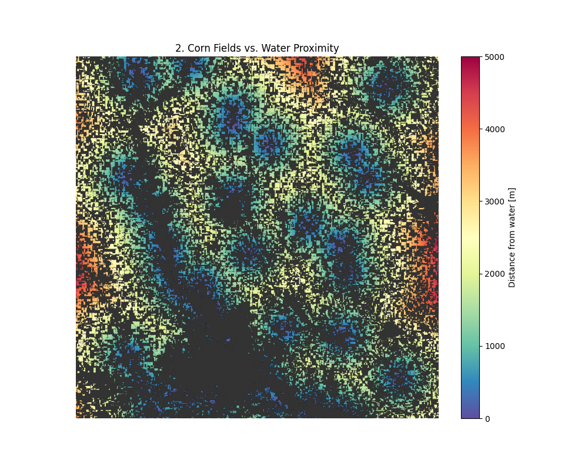
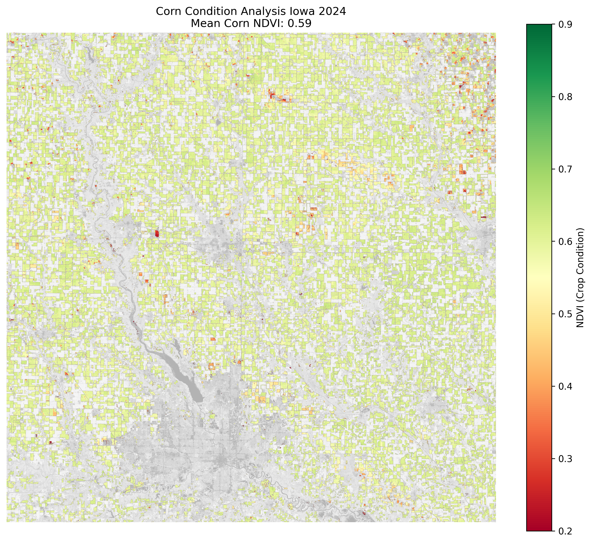
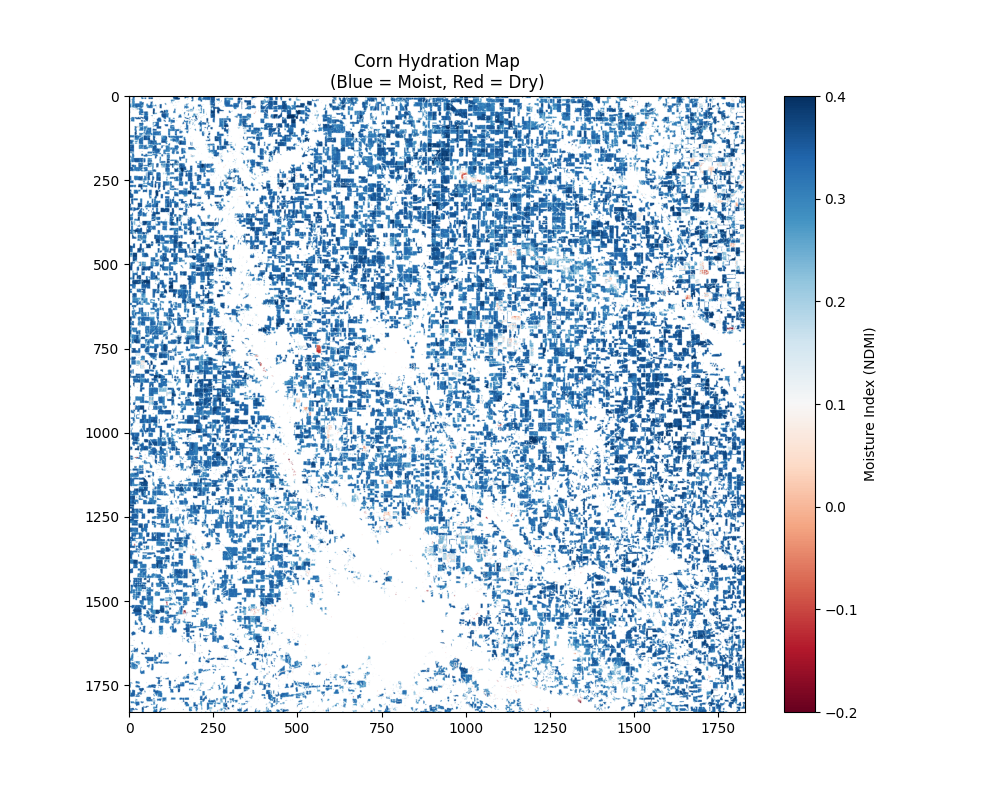
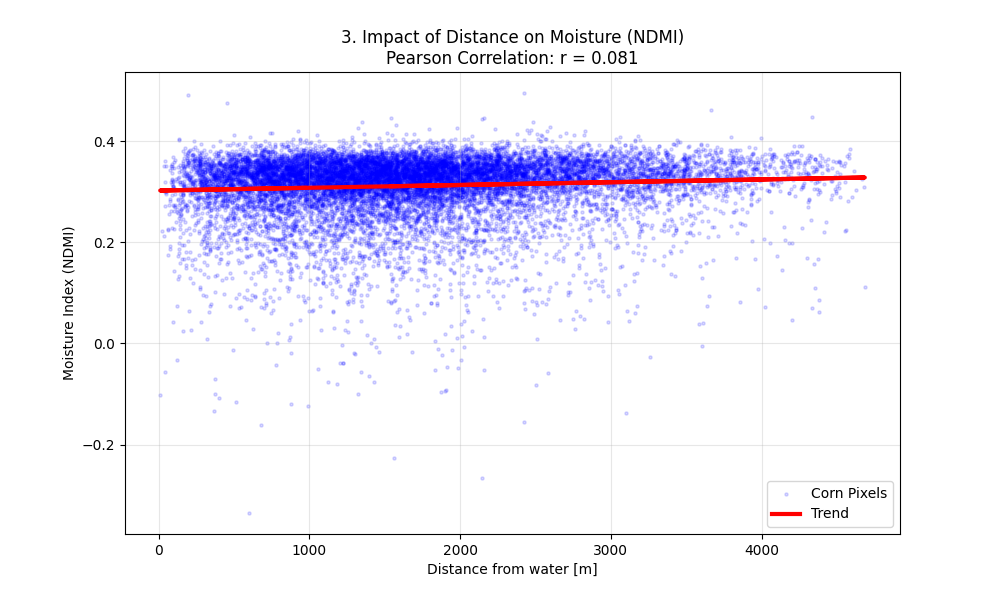
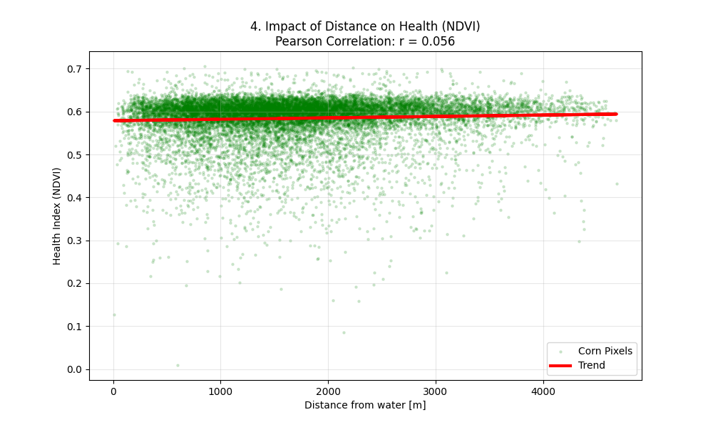
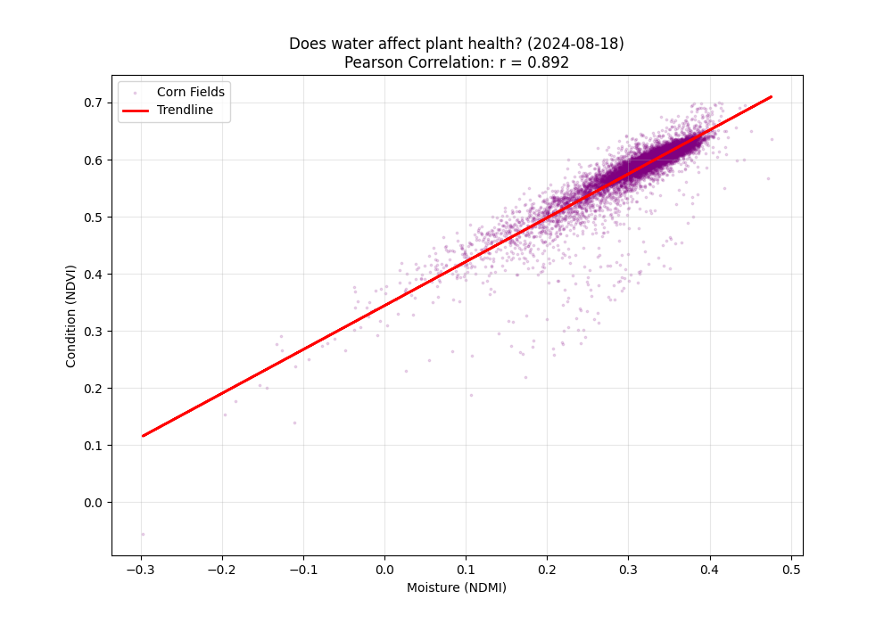

# Geospatial Analysis of Iowa Corn Status

This project provides a comprehensive geospatial and statistical analysis of corn crop health in Iowa. It integrates **Sentinel-2 satellite imagery** with **USDA Cropland Data** and **PRISM precipitation data** to analyze the impact of water proximity and rainfall on vegetation condition.

---

## Crop Classification & Vegetation Index
Initial processing involves classifying crops and generating a clean Normalized Difference Vegetation Index (NDVI) to assess overall biomass.

| Crop Distribution (USDA) | Clean NDVI Map |
|:---:|:---:|
|  |  |

---

## Hydrological Proximity Model
Analyzing how the distance to the nearest water sources (rivers/lakes) correlates with crop distribution.

| Water Proximity Model | Corn Fields vs. Water Distance |
|:---:|:---:|
|  |  |

---

## Focused Crop Analysis
By applying the USDA mask to the satellite data, we can observe the condition (NDVI) and moisture (NDMI) specifically for corn fields, ignoring surrounding vegetation.

  
  
   
  <em>Corn NDVI Overlay (Health) &nbsp;&nbsp;&nbsp;&nbsp;&nbsp;&nbsp;&nbsp;&nbsp;&nbsp;&nbsp;&nbsp;&nbsp;&nbsp;&nbsp;&nbsp;&nbsp;&nbsp;&nbsp;&nbsp;&nbsp; Corn NDMI Map (Moisture)</em>

---

## Statistical Correlations
These charts analyze how environmental factors (distance to water and rainfall) actually affect the biological status of the plants.

### 1. Distance from Water vs. Plant Status
| Moisture (NDMI) vs. Distance | Health (NDVI) vs. Distance |
|:---:|:---:|
|  |  |

### 2. Precipitation Impact
Relationship between actual monthly rainfall totals and corn health.

  
   
  <em>Correlation between cumulative rainfall and NDVI condition.</em>

---

## Technologies
* **Python 3.13**
* **Rasterio & GDAL** (Geospatial data processing)
* **NumPy** (Numerical analysis)
* **Matplotlib** (Data visualization)
* **Sentinel-2 L2A Data** (Satellite imagery)